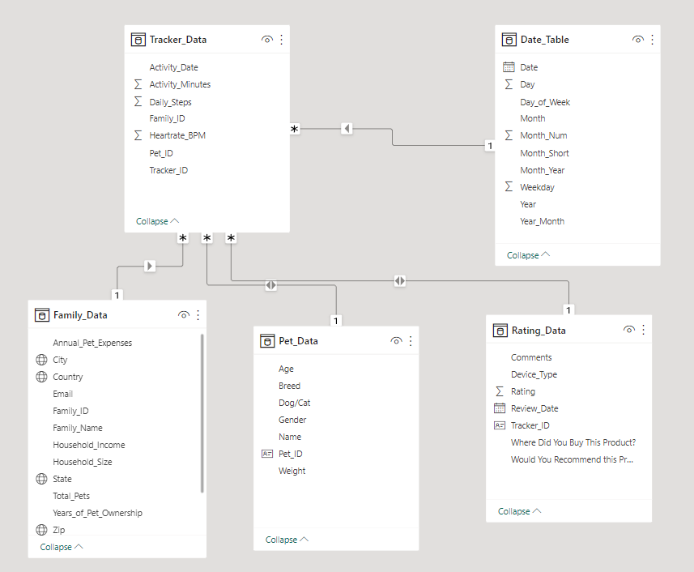
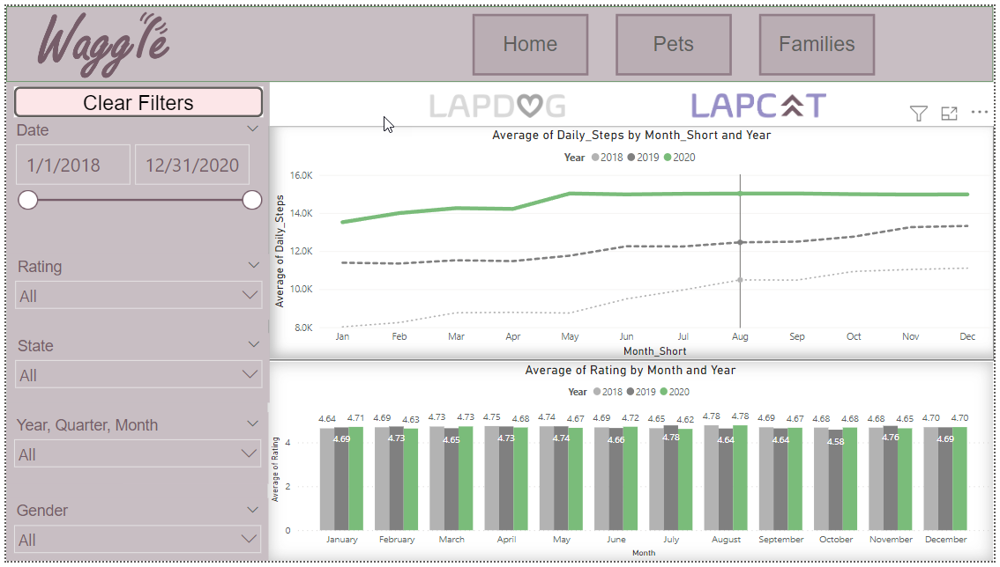
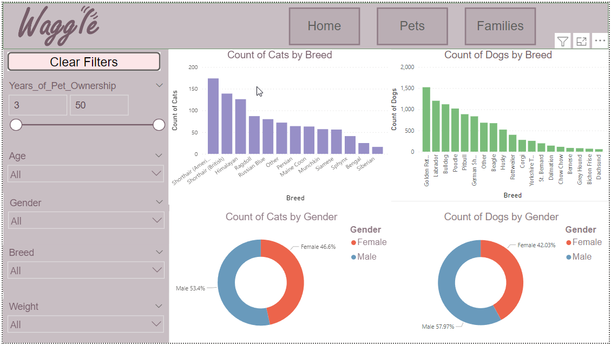
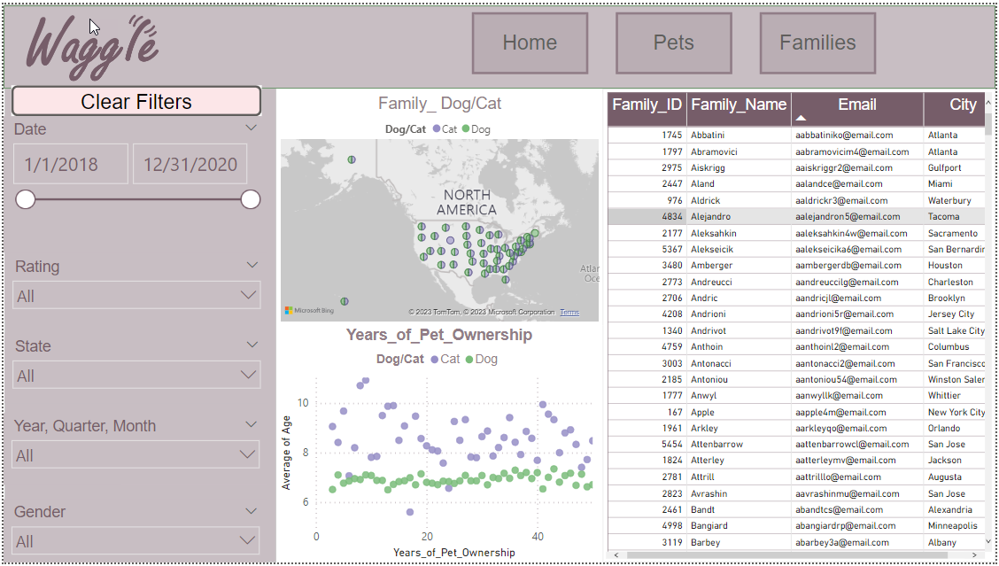
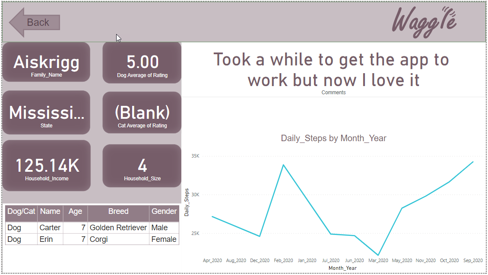

# Waggle Lapcat Device Analysis Project

## Overview
Get ready for an exciting journey! You are a business intelligence analyst at Waggle, a startup producing smart pet devices. The latest product, Lapdog, a smart collar for dogs that tracks steps, schedules walks, and repels fleas, has been a hit!

Due to Lapdog's success, Waggle's CEO is now considering a feline version - Lapcat. Before making the decision, they have tested 1,000 Lapcat prototypes. As a BI analyst, you are tasked with delivering a boardroom-ready Power BI report comparing the Lapcat data with the dog collar Lapdog data. Your findings will be used to determine whether Lapcat could be Waggle's next big thing or an expensive blunder.

## Business Requests

The CEO would like answers to the following questions:
- Did the average daily steps increase for cats wearing the device, similar to dogs?
- Were Lapcat device owners as satisfied as Lapdog owners?

The Chief Marketing Officer wants the report to follow the brand guidelines and include Waggle color palette, logos, and approved company icons.

The product team would like demographic comparisons of dogs and cats using Waggle devices, as well as information about pet-owning families. They would also appreciate slicers for personalized data exploration.

## Resources and Basic Requirements

A pre-provided data model and a variety of Waggle marketing images and branding guidelines will aid in creating the report. The report should follow best practices in clean layout design and color use, include at least 7 different Power BI visualizations, navigation buttons, bookmarks, and should meet the above business requests.

## Project Steps

1. **Review the data model and business questions**: Identify fields that can help answer the CEO’s questions.

2. **Develop visualizations**: Create visualizations that answer the CEO's questions about differences in average daily steps and satisfaction ratings between Lapcat and Lapdog owners.

3. **Demographic insights**: Create a variety of visuals, including bar charts, line charts, donut charts, tables/matrices, scatter plots, bubble maps, and cards to provide demographic insights.

4. **Design the layout**: Arrange your data visualizations with the most important findings first - CEO's questions on the first page, insights about dogs and cats on the second, and insights about pet owners on the third.

5. **Incorporate branding elements**: Use the Chief Marketing Officer's branding elements in your data visualizations.

6. **Include slicers**: Add at least five slicers on each page, including examples of a drop-down slicer, slider slicer, hierarchy slicer, "Select All" enabled slicer, and a slicer with a search box.

7. **Create bookmark features**: At least two bookmark features should be included. One should allow users to swap visuals dynamically, and the other should reset all applied filters.

8. **Create navigation buttons**: Buttons should be included for report navigation. These buttons must respond (by changing color or size) when users hover over them.

## Project Specifications

### Step 1: Business Questions & Insights

The Power BI report should address the CEO’s questions about differences in average daily steps over time and reviews between the Lapdog and Lapcat devices.

- The report should include at least one visual highlighting the difference (if any) in average daily steps between the Lapcat and Lapdog devices over time.
- The report should include at least one visual highlighting the difference (if any) between Lapdog and Lapcat ratings.

The Power BI report should include a variety of data visualizations:

- A second page focused on visualizations related specifically to the pets dataset.
- A third page focused on visualizations related specifically to the families dataset.
- The pages should include at least one example of each of these seven visualizations: Bar chart, line chart, table/matrix, donut chart, card, scatter plot, and bubble map.

### Step 2: Layout & Report Design

The layout and theme of the Power BI report should meet the Chief Marketing Officer’s branding expectations:

- The report should include a custom Power BI theme that incorporates the provided branding colors, as well as the Waggle logo in a banner or header.

The Power BI report should exercise careful attention to color consistency and web accessibility standards:

- Report colors should be consistent from start to finish, with the same color being used consistently for the same concept.
- Appropriate color layering should be used so that text and data points can be easily distinguished from any background colors.

The Power BI report should be logically ordered and intuitively designed:

- The report should include three pages, with the first focusing on the CEO’s driving business questions, the second focusing on pet demographics, and the third focusing on family and/or household insights.

### Step 3: Interactivity & Filtering

The Power BI report should demonstrate competence with slicer visualizations:

- The report should include at least five slicers on each page that users can use to filter the report.
- The report should include at least one example of each of the following slicer types: A drop-down slicer, a slider slicer, a hierarchy slicer, a slicer with a search box, and a slicer with “select all” enabled.

### Step 4: Controls & Navigation

The Power BI report should provide examples of Power BI’s bookmark capability:

- The report should include at least one bookmark that swaps one visual out with a different visual.
- The buttons for triggering the bookmarks should indicate which bookmark is active or inactive.
- The report should include at least one bookmark that resets all filters on a page to their default state.
- The button(s) for triggering the filter reset should alert the user by changing size or color when users hover.

The Power BI report should include multiple examples of buttons that can be used as navigation or bookmark triggers:

- The report should include at least two buttons that can be used to navigate the report.
- All buttons should respond to interaction when the user hovers over them by changing color and slightly changing size or thickness.

## Final Report Screenshots

### The Project Model

### Tab 1 - Home

### Tab 2 - Pets Report

### Tab 3 - Families Report

### Tab 4 - Summary

